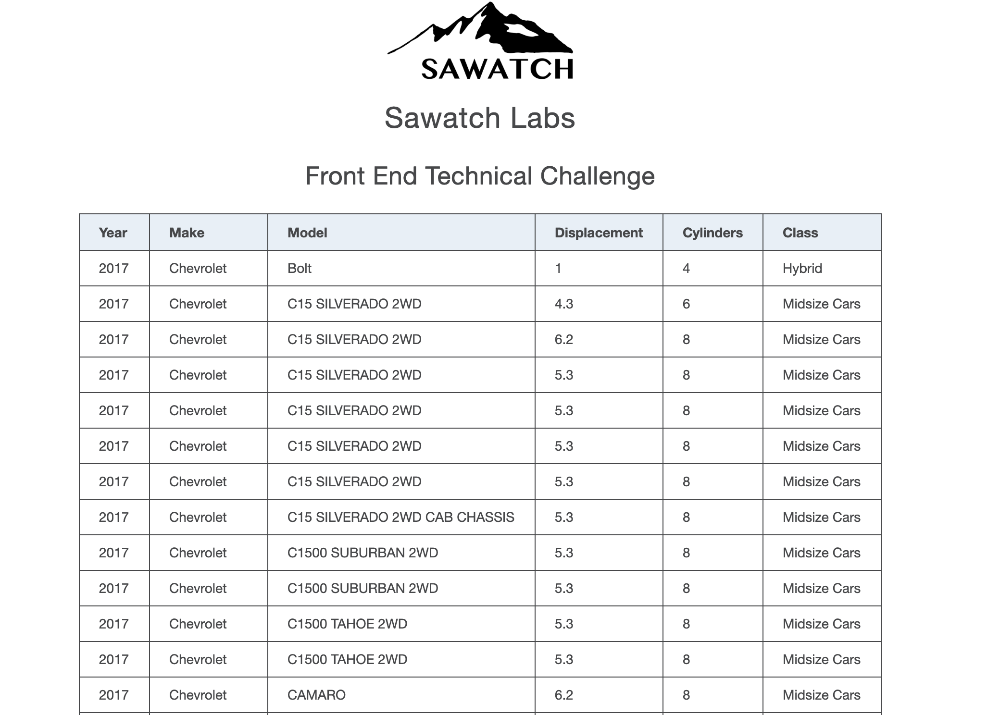

# sawatch-challenge-frontend

This is app was created to fetch information from an API and have the resulting information displayed in an organized table showing: Year, Make, Model, Displacement, Cylinders, and Class.  There is a series of functions written in JavaScript ES6 to retrieve and sort the data by Model.  

## Installation

1. Clone the repo to your local machine
2. Then run `npm install lite-server`
3. To have it load the HTML run `npx lite-server` 
  - this looks for the `bs-config.json` file to load the `sawatch-challenge.html`
4. Navigate to the browser that is opened when `lite-server` is run and enjoy

## Example Screenshot

Below is an example what should be displaying:

